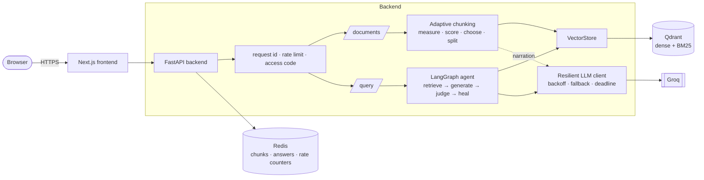
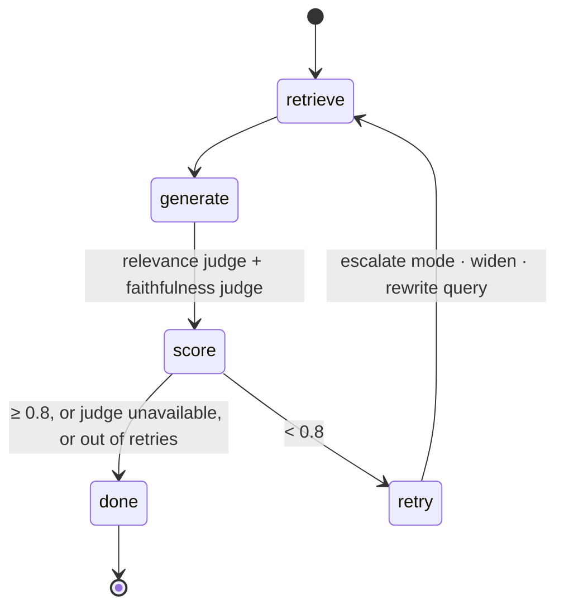

# 🩹 ResilientRAG

A RAG agent that **explains how it reads your file** and **heals its own bad answers**.

Drop in a PDF and it measures the document, decides how to split it, and tells you why while it works. Ask a question and it shows every search, every score, and every time it fixes its own mistake, escalating from plain vector search to hybrid search with reranking and query rewriting until the answer is grounded.

Rebuilt from [gurezende/SelfHealingRAG](https://github.com/gurezende/SelfHealingRAG) (credit to Gustavo R. Santos for the original idea and graph) into a service you can deploy: FastAPI + LangGraph backend, Next.js frontend, Groq for inference, Qdrant + Redis for state.

## What makes it different

| | |
|---|---|
| **Thinks out loud about chunking** | After upload it measures headings, code, digits, sentence length and topic shifts, scores seven strategies against *your* file, picks one, and streams the reasoning. The LLM narrates; measurement decides. |
| **Diagnoses why an answer is bad** | Two independent judges (right passages? stays in the source?) tell retrieval failures from generation failures, so the fix matches the problem. |
| **Heals, visibly** | `dense → dense+rerank → hybrid → hybrid+rerank`, wider budgets, rewritten queries. Every step streams to the UI as it happens. |
| **Measured, not asserted** | A benchmark of real PDFs with exact answer keys. Every published number is a real run; what could not be measured is listed. |
| **Built to survive** | Deadlines that stop abandoned work, quota-aware model fallback, bounded concurrency, fail-open caches, typed errors. Found by load-testing the real stack. |

## Architecture



The healing loop:



Full detail, sequence diagrams and data model: **[docs/ARCHITECTURE.md](docs/ARCHITECTURE.md)**.

## Quick start

Needs Docker and a free [Groq key](https://console.groq.com).

```bash
cp .env.example .env            # set GROQ_API_KEY
docker compose up --build       # frontend :3000, API :8000
```

Open <http://localhost:3000>, drop a PDF, ask a question. Without Docker: see [docs/DEVELOPMENT.md](docs/DEVELOPMENT.md).

## Deploy

| | what | guide |
|---|---|---|
| **Free demo** | frontend on **Vercel**, backend on a **Hugging Face Space** (Docker, 16 GB free) | [docs/DEPLOYMENT.md §A](docs/DEPLOYMENT.md) |
| **Server** | Docker Compose + Caddy (automatic HTTPS, access codes), Qdrant and Redis in volumes | [docs/DEPLOYMENT.md §B](docs/DEPLOYMENT.md) |

Vercel hosts only the frontend: the backend needs a long-running process and about 1 GB for three embedding models. The free demo keeps vectors in memory, so documents vanish on restart. A free Groq key allows roughly 50–130 questions a day, so keep access codes on for anything public.

## Using it

1. **Give it a file.** Watch the reasoning: reading, measuring, probing topic shifts, the vote between strategies, the pick, the chunk-size strip. *Skip the commentary* jumps to the result.
2. **Ask something.** Each attempt shows what was searched, the draft, both judges' scores, and what the agent changed. The answer card shows confidence, latency, tokens, and the passages it used.
3. **Make it yours.** Drop your own doodles into `frontend/public/doodles/` (see the README there).

## Documentation

| doc | for |
|---|---|
| [docs/ARCHITECTURE.md](docs/ARCHITECTURE.md) | how it works, diagrams, data model, security, limits |
| [docs/API.md](docs/API.md) | endpoints, SSE events, status codes |
| [docs/DEPLOYMENT.md](docs/DEPLOYMENT.md) | Vercel + Hugging Face, Docker/VPS, every setting, quota facts |
| [docs/RUNBOOK.md](docs/RUNBOOK.md) | symptoms and fixes, backups, upgrades, capacity |
| [docs/DEVELOPMENT.md](docs/DEVELOPMENT.md) | setup, tests, benchmarks, conventions, adding a strategy |
| [docs/DECISIONS.md](docs/DECISIONS.md) | why things are the way they are; lessons from running it for real |
| [eval/results/RESULTS.md](eval/results/RESULTS.md) | the measured results in full, with caveats |
| [CHANGELOG.md](CHANGELOG.md) | what changed vs the original |

## Tech stack

LangGraph · FastAPI · Next.js 15 / React 18 · Groq (`openai/gpt-oss-120b` answers, `qwen/qwen3.8-27b` judges and narration, `openai/gpt-oss-20b` fallback) · FastEmbed (MiniLM dense, BM25 sparse, MS-MARCO cross-encoder reranker, all local) · Qdrant · Redis · Docker · Caddy. 135 offline tests.

## What changed vs the original repo

| area | original | here |
|---|---|---|
| Embedding | re-embedded the whole document on every retry | embedded once per content hash, reused across retries |
| Chunking | one fixed splitter | measured per file, strategy chosen and explained |
| Retrieval | budget + rerank toggle; hybrid code never called | four-tier ladder with hybrid actually wired in |
| Judging | one blended score | relevance and faithfulness judged separately |
| Failures | any API error crashed the run | backoff, fallback model, deadlines, typed errors |
| UI coupling | business logic imported Streamlit | headless agent, separate Next.js UI, streamed trace |
| Evidence | none | real-PDF benchmark and load test |

## Caching

Chunk text is stored in Redis, on disk and in Qdrant payloads, so any replica can rebuild state. Answers are cached on `(document hash, normalised query, retrieval mode)`: mode is in the key so a cached plain-vector answer is never served after the loop escalated. Every Redis use fails open; if Redis is down the app serves uncached and rate-limits in-process.

## Measured results

Every number below was measured on real PDFs, real embeddings and real Groq calls. Nothing is mocked or dry-run. Full write-up, including what is **not** measured: [`eval/results/RESULTS.md`](eval/results/RESULTS.md). Raw per-question output is in `eval/results/*.json`.

**Benchmark.** Four generated PDFs of different shape (numbered manual, continuous prose, topic-shifting field notes, Python source) with invented facts, so a model cannot answer from memory. 160 questions, each with an exact answer key; correct means the answer contains the key (string match, no LLM judge). Each question is asked in the document's wording and as a paraphrase. Intervals are 95% Wilson. Built by `eval/make_bench.py`, run by `eval/run_bench.py`.

### Retrieval precision (complete run)

Metric: the top-3 retrieved chunks contain the whole answer sentence. All four documents, 320 queries per cell. Details: [`bench_chunking_sweep.md`](eval/results/bench_chunking_sweep.md).

| chunking | dense | hybrid + rerank |
|---|---|---|
| recursive, 500 chars | 98% (95–99) | 100% (99–100) |
| semantic, 500 chars | 92% (88–94) | 98% (95–99) |
| fixed, 500 chars | 88% (84–91) | 98% (95–99) |
| recursive, 900 chars | 91% (87–93) | 100% (98–100) |
| recursive, 1,600 chars (old default) | 80% (75–84) | 89% (85–92) |
| semantic, 1,600 chars | 81% (76–85) | 95% (92–97) |

- **Chunk size mattered more than strategy.** 1,600 → 500 characters raised recursive splitting by 11 points (hybrid) and 18 points (dense). The default is now 500 characters.
- **Semantic chunking did not beat plain recursive splitting at 500 characters.** It only looked good against the 1,600 default.
- **Caveat:** this is single-fact lookup. Questions needing a wide passage may prefer larger chunks, which is what the healing loop's growing retrieval budget is for.
- The sweep's `auto` column used the old default and the earlier, miscalibrated strategy picker. The picker was recalibrated afterwards and has not been re-benchmarked.

### End-to-end accuracy, latency and healing (partial run)

File: [`bench_e2e_run1.md`](eval/results/bench_e2e_run1.md). 8 questions × 4 documents × 2 wordings × 3 arms = 192 runs. 27 failed upstream on Groq rate limits and are excluded, never counted as correct, so arms have different n.

| arm | answered | correct | median latency | p95 latency | mean tokens |
|---|---|---|---|---|---|
| baseline (1,600-char chunks, dense, no healing) | 53 | 83% (71–91) | 40.8 s | 105 s | 2,987 |
| agent, no healing | 62 | 87% (77–93) | 16.5 s | 67 s | 1,480 |
| agent, full healing loop | 50 | 96% (87–99) | 29.9 s | 104 s | 2,663 |

- Paired on the 48 questions answered by both baseline and full agent: the agent fixed 6, broke 2, tied 40.
- Of 15 questions where the loop actually retried, 13 (87%) ended correct.
- The intervals overlap, so 96% vs 83% is suggestive, not proven at this sample size.
- Latency is dominated by rate-limit backoff on a free key. Treat it as a ceiling, not what the code costs on a paid tier.

### Healing trace: how a poor answer improves

Real trace from that run. Question: *"Which person was in charge of the Priprimir initiative at Northfield?"* (answer key: `Leona Castellan`).

| attempt | search | answer | correct |
|---|---|---|---|
| 1 | dense, k=3 | I didn't find any relevant documents. | no |
| 2 | dense + rerank, k=5 | I didn't find any relevant documents. | no |
| 3 | hybrid, k=7 | Leona Castellan led the Priprimir initiative. | yes |
| 4 | hybrid + rerank, k=9 | Leona Castellan. | yes |

Retry 1 escalated dense → dense+rerank and widened the budget. Retry 2 escalated to hybrid and rewrote the query to *"Who headed the Priprimir initiative at Northfield?"*. Retry 3 escalated to hybrid+rerank. Two more traces are in the report. The 0.00 judge scores in the raw trace come from the judge-outage defect below.

### Defects the benchmark found

- **Retired models.** The repo's default Groq models no longer exist for this key; every answer and judge call would have failed. Replaced, and `/health/ready` now reports missing models.
- **Judge outage treated as a bad answer.** A rate-limited judge scored correct answers 0.00 and the loop escalated retrieval for nothing. Now ends with `failure_reason=judge_unavailable` and returns the answer unverified. Unit-tested, but the benchmark has not been re-run with the fix, so the 96% above includes those wasted retries.

### Load test: 100 concurrent users (infrastructure, no LLM)

1,125 requests, **0 failures**, on the real Docker stack. Policy lookups p95 0.12 s, readiness p95 0.28 s; uploads are capped at 4 concurrent and queue (median 20 s under this load, about 1.6 s when alone), with a deliberate fast 429 beyond that. The test found and fixed four defects: unbounded upload concurrency (6 cores pegged, every upload 503), a readiness probe that blocked the event loop (38 s), thread-pool starvation, and abandoned questions that kept spending LLM quota. Details in [`RESULTS.md`](eval/results/RESULTS.md).

### What limits real use: the Groq free tier

Per model on this key: **8,000 tokens per minute, 200,000 tokens per day, 1,000 requests per day.** A question costs about 1,500–4,000 tokens, so the free tier allows roughly 50–130 questions per day. Running the benchmarks exhausted the judge model's daily budget. The client now switches to the fallback model immediately when a daily budget is spent. Question throughput at 100 users was therefore **not** measured successfully; those runs failed on quota. **A paid Groq tier is required before 100 people use this.**

### Not measured

- Refusal rate on unanswerable questions (`run_bench.py unanswerable` exists, never run).
- Question latency and failure rate at 100 concurrent users (blocked by the quota above).
- End-to-end accuracy after the judge fix, Retry-After backoff, the 500-character default, the recalibrated picker and the deadline fix.
- Statistical significance of the agent vs baseline gap.

### Reproduce

```bash
cd backend
uv run --extra dev python ../eval/make_bench.py
uv run --extra dev python ../eval/run_bench.py chunking --tag sweep --configs recursive_character@500 recursive_character semantic auto
uv run --extra dev python ../eval/run_bench.py e2e --per-doc 8 --workers 1
```

## Honest status

- Works end to end and is deployable (Docker stack and the free Vercel + Space shape both verified live).
- **Not measured:** question latency and failure rate at 100 concurrent users (blocked by the free LLM quota), refusal rate on unanswerable questions, and end-to-end accuracy after the latest fixes. The 96% accuracy figure above predates them.
- Access codes are not user accounts; there is no retention policy or OCR. See [docs/ARCHITECTURE.md §8](docs/ARCHITECTURE.md).

## Possible extensions

Sentence-window and parent-child chunking (need a second index) · user accounts and document ownership · retention and deletion API · OCR for scans · semantic answer cache · ColBERT as a fifth retrieval tier · per-domain score weighting.

## Credits and license

Original concept and graph design: [Gustavo R. Santos](https://gustavorsantos.me), [gurezende/SelfHealingRAG](https://github.com/gurezende/SelfHealingRAG). MIT, see [LICENSE](LICENSE).
