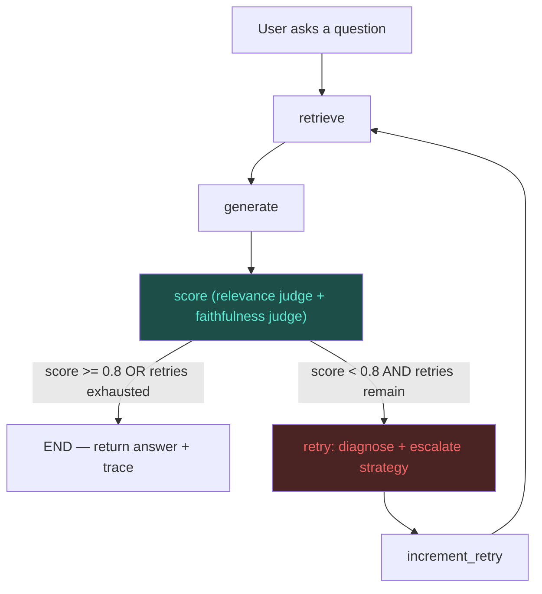

# 🩹 ResilientRAG

A self-healing Retrieval-Augmented Generation agent that detects *why* an answer is bad — bad retrieval or bad grounding — and automatically escalates its own strategy before retrying.

This is a from-scratch rebuild of [gurezende/SelfHealingRAG](https://github.com/gurezende/SelfHealingRAG), restructured as a production-shaped portfolio project: a FastAPI + LangGraph backend, a Next.js frontend, Groq for inference, persistent Qdrant + Redis, Docker, a 111-test suite, and a real-PDF evaluation harness. Credit to [Gustavo R. Santos](https://gustavorsantos.me) for the original concept and graph design.

## Why the rename

"Self-Healing RAG" described the *goal*. "ResilientRAG" describes what actually got built: resilience isn't just the retry loop — it's the LLM-call backoff/fallback, the graceful cache degradation, and the split failure diagnosis that make the healing trustworthy instead of just a budget bump in a loop.

## What changed vs. the original repo

| Area | Original repo | ResilientRAG |
|---|---|---|
| Re-embedding | Re-embeds the **entire document on every retry** | Documents are embedded once per content hash and persisted in Qdrant; retries reuse the index |
| Retrieval strategies | Budget + binary rerank toggle only | 4-tier escalation ladder: `dense → dense_rerank → hybrid → hybrid_rerank`, with hybrid (dense+BM25, RRF-fused) **wired in and used** — the original shipped this code but never called it from the graph |
| Query on repeated failure | Unchanged, just re-run with a bigger budget | After the configured retry threshold, an LLM **rewrites the query** before the next retrieval attempt |
| Judge | One blended score from one LLM call, parsed with a bare `json.loads` | **Two independent judges** (relevance, faithfulness), each schema-validated via Pydantic from JSON-mode output — lets the agent tell "wrong docs" apart from "hallucinated answer" |
| LLM calls | Unguarded `client.chat.completions.create(...)` — any API error crashes the run | Retry with exponential backoff, then fall back to a smaller model, with per-call latency/token capture |
| UI coupling | Business logic (`nodes.py`) imports `streamlit` directly — can't run headlessly | Nodes are pure functions returning plain dicts; UI is a separate Next.js app talking to a FastAPI backend |
| Caching | None — same question re-embeds and re-asks every time | Redis-backed embedding/answer cache, degrades to a no-op if Redis is unreachable rather than crashing (see [Caching](#caching)) |
| Tests | None | 111 tests (see [Testing](#testing)) |
| Evaluation | None | Labeled 20-question eval set, offline retrieval metrics + baseline-vs-healed generation metrics (see [Evaluation](#evaluation)) |
| Deployment | `streamlit run app.py` only | Dockerized (backend, frontend, Qdrant, Redis via `docker-compose`) |
| API hardening | None — single-user local script | Request-ID correlation, Redis-backed rate limiting, typed exception handling (no leaked stack traces), upload size limits, liveness + readiness health checks |

## Architecture



The `retry` node is where the healing policy lives:

| Failure reason | Meaning | Healing action |
|---|---|---|
| `irrelevant_docs` | Retrieved docs don't match the query topic at all | Escalate retrieval mode one tier up the ladder, increase budget by 2; rewrite the query starting from the 2nd retry |
| `missing_context` | Docs are on-topic but incomplete | Escalate retrieval mode, increase budget by 3; rewrite the query starting from the 2nd retry |
| `unfaithful_answer` | Docs were fine, but the generated answer made unsupported claims | **Retrieval mode is left unchanged** (it's not a retrieval problem) — budget bumped by 1 and the next generation attempt uses a stricter grounding prompt |
| `none` | Answer passed both judges | Stop |

Splitting `irrelevant_docs`/`missing_context` (retrieval failures) from `unfaithful_answer` (a generation failure) is the piece the original repo's single blended judge couldn't do — it would see a low score either way and have no way to tell whether changing the retrieval strategy would even help.

## Caching

Two independent caching layers, both in Redis, both designed to **fail open** — if Redis is down, the app degrades to "no caching" rather than erroring out (`SafeRedisCache` in `backend/app/agent/cache.py` wraps every Redis call in a try/except and checks connectivity once at startup):

1. **Embedding/index persistence (the big one).** This is the direct fix for the original repo's worst bug: `retrieve_node` called `embed_docs(text)` unconditionally on *every single call*, including every retry — so a 3-retry healing run re-embedded the whole document 4 times. Here, each document is content-hashed (`hash_chunks()`), and `VectorStore.index_chunks()` checks `collection_exists()` before doing any embedding work at all. The collection is keyed by that hash, so the same document uploaded twice — or retried 5 times in one healing loop — is embedded exactly once. This isn't really "caching" in the request/response sense; it's closer to memoization backed by Qdrant itself as the persistent store, which is why it doesn't even need Redis to work.
2. **Answer cache (`AnswerCache`).** Keyed on `(document_hash, normalized_query, retrieval_mode)` — same document, same question (case/whitespace-insensitive), same retrieval strategy → skip the LLM call entirely and return the cached answer. This is the one that actually saves API cost/latency on repeat questions. It's deliberately *not* semantic (a rephrased question is a cache miss) — see [Trade-offs](#trade-offs-and-things-deliberately-left-out) for why.

Why `retrieval_mode` is part of the cache key rather than just `(document, query)`: the same question can legitimately get different answers depending on which retrieval strategy served it (that's the entire premise of self-healing) — caching across modes would mean a cached answer from a `dense`-mode pass could get served even after the healing loop escalated to `hybrid_rerank`, silently undoing the healing.

What's *not* cached, on purpose: judge scores. Caching the judge's verdict alongside the answer would mean a document that gets re-embedded with different content (same hash is unlikely to collide, but a *different* retrieval_mode on the same question is a real path) could serve a stale faithfulness verdict for a different actual answer. The answer and the judgment of that answer are cached as one unit or not at all.

## Tech stack

- **Orchestration:** LangGraph (kept — it's the right tool for explicit retry/branching state machines; this is the one piece of the original stack that wasn't swapped out)
- **Backend:** FastAPI (Python)
- **Frontend:** Next.js / React (TypeScript)
- **Model layer:** Groq (free tier) — `openai/gpt-oss-120b` primary, `openai/gpt-oss-20b` fallback, `qwen/qwen3.8-27b` judge (a different model family from the generator on purpose)
- **Embeddings:** FastEmbed, local (`all-MiniLM-L6-v2` dense, Qdrant's BM25 sparse) — no API key or cost
- **Retrieval & memory:** Qdrant (persistent, named dense + sparse vectors)
- **Data layer:** Redis (embedding/answer cache)
- **Deployment:** Docker + docker-compose (backend, frontend, Qdrant, Redis as four services)

### A note on the originally-suggested stack

The brief also offered Next.js/Supabase/HumanLoop/Phoenix/Vercel. I kept LangGraph+Qdrant (proven fit, already in the source repo) and added FastAPI/Next.js/Groq/Redis/Docker on top, rather than also introducing Supabase+Postgres+Vercel — see [Trade-offs](#trade-offs-and-things-deliberately-left-out) for why.

## Project structure

```
ResilientRAG/
├── backend/
│   ├── app/
│   │   ├── agent/           # state, nodes, graph, retrieval, judges, llm, cache, vectorstore
│   │   ├── routers/         # FastAPI endpoints (documents, query)
│   │   ├── config.py        # env-driven settings
│   │   ├── schemas.py       # API request/response models
│   │   ├── exceptions.py    # typed operational errors (RetrievalBackendError, etc.)
│   │   ├── middleware.py    # request-ID correlation, Redis-backed rate limiting
│   │   └── main.py          # exception handlers, health/readiness checks
│   └── tests/                # 67 tests, mocked LLM/vector store, no network required
├── frontend/
│   └── app/                  # Next.js app router: upload panel, chat panel, healing trace view
├── eval/
│   ├── corpus.json            # 16-passage labeled knowledge base
│   ├── dataset.jsonl           # 20 questions with gold relevant chunks + difficulty tags
│   ├── run_retrieval_eval.py  # precision@k / recall@k per retrieval mode
│   ├── run_generation_eval.py # baseline vs. self-healing, scored end-to-end
│   └── results/                # measured results only (bench_*.md / .json)
├── docker-compose.yml
└── .env.example
```

## Running it

### Docker (recommended)

```bash
cp .env.example .env   # fill in GROQ_API_KEY
docker compose up --build
```

Backend: `http://localhost:8000` (docs at `/docs`). Frontend: `http://localhost:3000`.

### Locally

```bash
# Backend
cd backend
pip install -e ".[dev]"
export GROQ_API_KEY=your_key_here
# Qdrant + Redis need to be running (docker compose up qdrant redis, or set
# QDRANT_USE_MEMORY=true / CACHE_ENABLED=false to skip them for a quick local run)
uvicorn app.main:app --reload

# Frontend, in another shell
cd frontend
npm install
npm run dev
```

## Testing

Unit + integration tests use a fake LangGraph-compatible `VectorStore` and `LLMClient` (see `backend/tests/conftest.py`), so the whole suite runs offline with no API key and no Docker services — including the real Qdrant engine in `:memory:` mode for the vector-store plumbing tests.

```
$ cd backend && pytest tests/ --cov=app --cov-report=term-missing
111 passed
```

| Module | Coverage |
|---|---|
| `agent/judges.py`, `agent/llm.py`, `agent/query_rewrite.py`, `agent/state.py`, `config.py`, `exceptions.py` | 100% |
| `agent/graph.py` | 100% |
| `middleware.py` | 98% |
| `agent/vectorstore.py` | 90% |
| `routers/documents.py` | 91% |
| `agent/cache.py` | 87% |
| `agent/nodes.py` | 93% |
| `main.py` | 83% |
| **Overall** | **93%** (718 statements, 52 missed — mostly FastAPI route plumbing not reachable without live infra) |

What's actually exercised, not just covered:
- **The healing loop really heals**: `test_heals_after_one_failed_attempt` scripts a judge that fails on attempt 1 (`missing_context`, score 0.6) and passes on attempt 2 (score 0.9), and asserts the graph terminates with the improved score and a one-entry healing trace.
- **The re-embedding bug is fixed**: `test_document_embedded_only_once_across_all_retries` runs a 3-retry healing sequence and asserts the vector store's `index_chunks` was called exactly once.
- **LLM resilience is real**: `test_llm_resilience.py` mocks the Groq client to raise `RateLimitError`/`APITimeoutError`, asserting correct backoff-then-retry, fallback-model switchover after retries are exhausted, and a typed `LLMCallError` (not a crash) when every attempt fails.
- **Relevance and faithfulness are genuinely independent**: `test_unfaithful_detected_independently_of_relevance` scripts a judge returning perfect relevance (1.0) alongside poor faithfulness (0.2) and asserts the failure reason is correctly attributed to generation, not retrieval.
- **Failures don't leak internals**: `test_hardening.py` forces a retrieval-backend exception through the real FastAPI app and asserts the response is a clean 503 with no exception class name or traceback text in the body — and does the same for an arbitrary unhandled exception (clean 500 + correlation ID).
- **The rate limiter fails open**: `test_unavailable_redis_fails_open` asserts requests are still served when Redis itself is down, so the limiter can't become a single point of failure.

## Measured results

Every number below was produced by running the code in this repo against real PDFs, real embeddings and real Groq calls. No mocked or dry-run figures are reported. Reproduce with `eval/make_bench.py` then `eval/run_bench.py`; raw per-question output is in `eval/results/*.json`.

**Benchmark.** Four generated PDFs of different shape (a numbered manual, continuous prose, topic-shifting field notes, Python source). Facts are invented, so a model cannot answer from memory. Each question has an exact answer key, and correctness is a string match, not an LLM opinion. Each question is asked in the document's own wording and as a paraphrase. Intervals are 95% Wilson.

### Retrieval precision (top-3 contains the whole answer sentence)

See [`eval/results/bench_chunking_sweep.md`](eval/results/bench_chunking_sweep.md). Headline: **chunk size mattered far more than chunking strategy.** Recursive splitting at 500 characters hit 100% (99–100%) with hybrid+rerank and 98% (95–99%) with dense only, against 89% (85–92%) and 80% (75–84%) at 1,600 characters. Semantic chunking beat recursive only at the old 1,600 size and did not beat it at 500. The default is therefore 500 characters, not the usual 300–500 *token* advice. Caveat: this benchmark is single-fact lookup; explanatory questions that need a wide passage may prefer larger chunks, which is what the healing loop's growing retrieval budget is for.

### End-to-end accuracy, latency, healing

See [`eval/results/bench_e2e.md`](eval/results/bench_e2e.md): baseline (tutorial setup: 1,600-char chunks, dense search, no healing), the agent without healing, and the full agent, 8 questions × 4 documents × 2 wordings. It includes accuracy with intervals, p50/p95 latency, token cost, a paired fixed-vs-broken count, and full healing traces for answers that started wrong.

Honest limits of that run: Groq's rate limits made some calls fail upstream; those are counted separately and excluded from accuracy, never scored as correct. Latency in that run is dominated by rate-limit backoff, so treat it as a ceiling for a free-tier key, not a property of the code.

### Reproduce

```bash
cd backend
uv run --extra dev python ../eval/make_bench.py
uv run --extra dev python ../eval/run_bench.py chunking --tag sweep --configs recursive_character@500 recursive_character semantic auto
uv run --extra dev python ../eval/run_bench.py e2e --per-doc 8 --workers 2
```

## Trade-offs and things deliberately left out

- **ColBERT late-interaction retrieval** was in the original repo's dead code (`retrieve_docs_hybrid.py`) alongside dense+BM25, but I didn't wire it in. It's a third retrieval path with a large model download and real added latency, for marginal gain over dense+BM25+cross-encoder-rerank at this corpus scale. Documented as a clear next extension instead of built half-heartedly.
- **Supabase/Postgres instead of Qdrant+Redis** wasn't adopted. Qdrant was already proven in the source repo for this exact use case (named dense+sparse vectors, which Supabase's pgvector doesn't support as cleanly), and adding a third stateful service (Postgres, on top of Qdrant and Redis) for a single-document-at-a-time demo app would be infrastructure for its own sake.
- **Phoenix/HumanLoop instead of a custom eval harness**: chosen because it produces a self-contained, dependency-free artifact (plain JSON/Markdown) that doesn't require standing up another service or an external account to reproduce — at the cost of not getting a hosted tracing UI for free.
- **Combined score is a simple 50/50 average** of relevance and faithfulness. A production system would likely weight these per use case (e.g. faithfulness matters more for medical/legal domains) — left as a config knob (`score_pass_threshold`) rather than a fixed weighting scheme, since the right weighting is domain-specific.
- **The answer cache is keyed on exact (document, query, retrieval_mode)**, not semantic similarity — a rephrased question is a cache miss. A semantic cache (embed the query, check for a near-duplicate) would catch more repeats but adds another embedding call on the hot path for a demo-scale app.

## Possible extensions

- Multi-document routing (the original repo's suggestion, still open)
- Semantic answer caching
- ColBERT as a 5th retrieval tier for corpora large enough to need it
- Per-domain score weighting instead of a fixed 50/50 relevance/faithfulness blend
- Streaming the healing trace to the frontend as it happens, instead of returning it all at the end

## License

MIT, same as the original repo.
