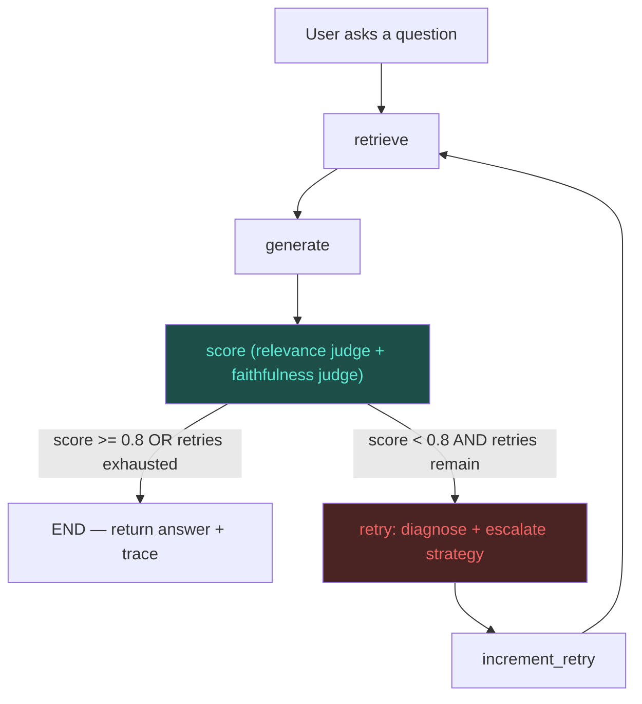

# 🩹 ResilientRAG

A self-healing Retrieval-Augmented Generation agent that detects *why* an answer is bad — bad retrieval or bad grounding — and automatically escalates its own strategy before retrying.

This is a from-scratch rebuild of [gurezende/SelfHealingRAG](https://github.com/gurezende/SelfHealingRAG), restructured as a production-shaped portfolio project: a FastAPI + LangGraph backend, a Next.js frontend, Groq for inference, persistent Qdrant + Redis, Docker, a 55-test suite, and an evaluation harness. Credit to [Gustavo R. Santos](https://gustavorsantos.me) for the original concept and graph design.

## Why the rename

"Self-Healing RAG" described the *goal*. "ResilientRAG" describes what actually got built: resilience isn't just the retry loop — it's the LLM-call backoff/fallback, the graceful cache degradation, and the split failure diagnosis that make the healing trustworthy instead of just a budget bump in a loop.

## What changed vs. the original repo

| Area | Original repo | ResilientRAG |
|---|---|---|
| Re-embedding | Re-embeds the **entire document on every retry** | Documents are embedded once per content hash and persisted in Qdrant; retries reuse the index |
| Retrieval strategies | Budget + binary rerank toggle only | 4-tier escalation ladder: `dense → dense_rerank → hybrid → hybrid_rerank`, with hybrid (dense+BM25, RRF-fused) **wired in and used** — the original shipped this code but never called it from the graph |
| Query on repeated failure | Unchanged, just re-run with a bigger budget | After the configured retry threshold, an LLM **rewrites the query** before the next retrieval attempt |
| Judge | One blended score from one LLM call, parsed with a bare `json.loads` | **Two independent judges** (relevance, faithfulness), each schema-validated via Pydantic from JSON-mode output — lets the agent tell "wrong docs" apart from "hallucinated answer" |
| LLM calls | Unguarded `client.chat.completions.create(...)` — any API error crashes the run | Retry with exponential backoff, then fall back to a smaller model, with per-call latency/token capture |
| UI coupling | Business logic (`nodes.py`) imports `streamlit` directly — can't run headlessly | Nodes are pure functions returning plain dicts; UI is a separate Next.js app talking to a FastAPI backend |
| Caching | None — same question re-embeds and re-asks every time | Redis-backed embedding/answer cache, degrades to a no-op if Redis is unreachable rather than crashing |
| Tests | None | 55 tests, 92% coverage (see [Testing](#testing)) |
| Evaluation | None | Labeled 20-question eval set, offline retrieval metrics + baseline-vs-healed generation metrics (see [Evaluation](#evaluation)) |
| Deployment | `streamlit run app.py` only | Dockerized (backend, frontend, Qdrant, Redis via `docker-compose`) |

## Architecture



The `retry` node is where the healing policy lives:

| Failure reason | Meaning | Healing action |
|---|---|---|
| `irrelevant_docs` | Retrieved docs don't match the query topic at all | Escalate retrieval mode one tier up the ladder, increase budget by 2; rewrite the query starting from the 2nd retry |
| `missing_context` | Docs are on-topic but incomplete | Escalate retrieval mode, increase budget by 3; rewrite the query starting from the 2nd retry |
| `unfaithful_answer` | Docs were fine, but the generated answer made unsupported claims | **Retrieval mode is left unchanged** (it's not a retrieval problem) — budget bumped by 1 and the next generation attempt uses a stricter grounding prompt |
| `none` | Answer passed both judges | Stop |

Splitting `irrelevant_docs`/`missing_context` (retrieval failures) from `unfaithful_answer` (a generation failure) is the piece the original repo's single blended judge couldn't do — it would see a low score either way and have no way to tell whether changing the retrieval strategy would even help.

## Tech stack

- **Orchestration:** LangGraph (kept — it's the right tool for explicit retry/branching state machines; this is the one piece of the original stack that wasn't swapped out)
- **Backend:** FastAPI (Python)
- **Frontend:** Next.js / React (TypeScript)
- **Model layer:** Groq (free tier) — `llama-3.3-70b-versatile` primary, `llama-3.1-8b-instant` fallback and judge model
- **Embeddings:** FastEmbed, local (`all-MiniLM-L6-v2` dense, Qdrant's BM25 sparse) — no API key or cost
- **Retrieval & memory:** Qdrant (persistent, named dense + sparse vectors)
- **Data layer:** Redis (embedding/answer cache)
- **Deployment:** Docker + docker-compose (backend, frontend, Qdrant, Redis as four services)

### A note on the originally-suggested stack

The brief also offered Next.js/Supabase/HumanLoop/Phoenix/Vercel. I kept LangGraph+Qdrant (proven fit, already in the source repo) and added FastAPI/Next.js/Groq/Redis/Docker on top, rather than also introducing Supabase+Postgres+Vercel — see [Trade-offs](#trade-offs-and-things-deliberately-left-out) for why.

## Project structure

```
ResilientRAG/
├── backend/
│   ├── app/
│   │   ├── agent/           # state, nodes, graph, retrieval, judges, llm, cache, vectorstore
│   │   ├── routers/         # FastAPI endpoints (documents, query)
│   │   ├── config.py        # env-driven settings
│   │   ├── schemas.py       # API request/response models
│   │   └── main.py
│   └── tests/                # 55 tests, mocked LLM/vector store, no network required
├── frontend/
│   └── app/                  # Next.js app router: upload panel, chat panel, healing trace view
├── eval/
│   ├── corpus.json            # 16-passage labeled knowledge base
│   ├── dataset.jsonl           # 20 questions with gold relevant chunks + difficulty tags
│   ├── run_retrieval_eval.py  # precision@k / recall@k per retrieval mode
│   ├── run_generation_eval.py # baseline vs. self-healing, scored end-to-end
│   └── results/                # output of both scripts (dry-run + real)
├── docker-compose.yml
└── .env.example
```

## Running it

### Docker (recommended)

```bash
cp .env.example .env   # fill in GROQ_API_KEY
docker compose up --build
```

Backend: `http://localhost:8000` (docs at `/docs`). Frontend: `http://localhost:3000`.

### Locally

```bash
# Backend
cd backend
pip install -e ".[dev]"
export GROQ_API_KEY=your_key_here
# Qdrant + Redis need to be running (docker compose up qdrant redis, or set
# QDRANT_USE_MEMORY=true / CACHE_ENABLED=false to skip them for a quick local run)
uvicorn app.main:app --reload

# Frontend, in another shell
cd frontend
npm install
npm run dev
```

## Testing

Unit + integration tests use a fake LangGraph-compatible `VectorStore` and `LLMClient` (see `backend/tests/conftest.py`), so the whole suite runs offline with no API key and no Docker services — including the real Qdrant engine in `:memory:` mode for the vector-store plumbing tests.

```
$ cd backend && pytest tests/ --cov=app --cov-report=term-missing
55 passed in 2.65s
```

| Module | Coverage |
|---|---|
| `agent/judges.py`, `agent/llm.py`, `agent/query_rewrite.py`, `agent/state.py`, `config.py` | 100% |
| `agent/graph.py` | 100% |
| `agent/vectorstore.py` | 90% |
| `agent/cache.py` | 90% |
| `agent/nodes.py` | 92% |
| **Overall** | **92%** (614 statements, 49 missed — mostly FastAPI route plumbing and a PDF-specific code path not hit by text-fixture tests) |

What's actually exercised, not just covered:
- **The healing loop really heals**: `test_heals_after_one_failed_attempt` scripts a judge that fails on attempt 1 (`missing_context`, score 0.6) and passes on attempt 2 (score 0.9), and asserts the graph terminates with the improved score and a one-entry healing trace.
- **The re-embedding bug is fixed**: `test_document_embedded_only_once_across_all_retries` runs a 3-retry healing sequence and asserts the vector store's `index_chunks` was called exactly once.
- **LLM resilience is real**: `test_llm_resilience.py` mocks the Groq client to raise `RateLimitError`/`APITimeoutError`, asserting correct backoff-then-retry, fallback-model switchover after retries are exhausted, and a typed `LLMCallError` (not a crash) when every attempt fails.
- **Relevance and faithfulness are genuinely independent**: `test_unfaithful_detected_independently_of_relevance` scripts a judge returning perfect relevance (1.0) alongside poor faithfulness (0.2) and asserts the failure reason is correctly attributed to generation, not retrieval.

## Evaluation

Two scripts, two layers — see **[`eval/README.md`](eval/README.md)** for full detail. Short version:

- `run_retrieval_eval.py` — precision@3 / recall@3 per retrieval mode against 20 labeled questions.
- `run_generation_eval.py` — baseline (no healing) vs. self-healing, scored end-to-end through Groq.

**Both were authored and smoke-tested with `--dry-run`** inside this build environment, whose outbound network is restricted to PyPI/npm/GitHub — HuggingFace Hub (needed for real embeddings) and the Groq API are both unreachable from here. The dry-run mode swaps in deterministic fake embedding/LLM components (the same fixtures the test suite uses) purely to prove the harness runs end-to-end; **the numbers below are not real retrieval or answer quality** and are labeled `"dry_run": true` in the output files. Real numbers require running the two commands in `eval/README.md` on a machine with normal internet access and a Groq key — do that before citing these in a portfolio write-up.

<details>
<summary>Dry-run harness output (proof it runs, not a quality measurement)</summary>

Generation eval (baseline vs. self-healing), scripted with a judge that fails easy questions never, medium questions once, hard questions twice:

| Metric | Baseline | Self-Healing |
|---|---|---|
| Mean combined score | 0.758 | 0.925 |
| Pass rate (≥0.8) | 65.0% | 100.0% |

Questions improved: 7/20. Mean retries: 0.55/question. Mean token overhead: 24.8/question.

Full output: [`eval/results/generation_eval_report_dry_run.md`](eval/results/generation_eval_report_dry_run.md), [`eval/results/retrieval_eval_report_dry_run.md`](eval/results/retrieval_eval_report_dry_run.md).
</details>

## Trade-offs and things deliberately left out

- **ColBERT late-interaction retrieval** was in the original repo's dead code (`retrieve_docs_hybrid.py`) alongside dense+BM25, but I didn't wire it in. It's a third retrieval path with a large model download and real added latency, for marginal gain over dense+BM25+cross-encoder-rerank at this corpus scale. Documented as a clear next extension instead of built half-heartedly.
- **Supabase/Postgres instead of Qdrant+Redis** wasn't adopted. Qdrant was already proven in the source repo for this exact use case (named dense+sparse vectors, which Supabase's pgvector doesn't support as cleanly), and adding a third stateful service (Postgres, on top of Qdrant and Redis) for a single-document-at-a-time demo app would be infrastructure for its own sake.
- **Phoenix/HumanLoop instead of a custom eval harness**: chosen because it produces a self-contained, dependency-free artifact (plain JSON/Markdown) that doesn't require standing up another service or an external account to reproduce — at the cost of not getting a hosted tracing UI for free.
- **Combined score is a simple 50/50 average** of relevance and faithfulness. A production system would likely weight these per use case (e.g. faithfulness matters more for medical/legal domains) — left as a config knob (`score_pass_threshold`) rather than a fixed weighting scheme, since the right weighting is domain-specific.
- **The answer cache is keyed on exact (document, query, retrieval_mode)**, not semantic similarity — a rephrased question is a cache miss. A semantic cache (embed the query, check for a near-duplicate) would catch more repeats but adds another embedding call on the hot path for a demo-scale app.

## Possible extensions

- Multi-document routing (the original repo's suggestion, still open)
- Semantic answer caching
- ColBERT as a 5th retrieval tier for corpora large enough to need it
- Per-domain score weighting instead of a fixed 50/50 relevance/faithfulness blend
- Streaming the healing trace to the frontend as it happens, instead of returning it all at the end

## License

MIT, same as the original repo.
