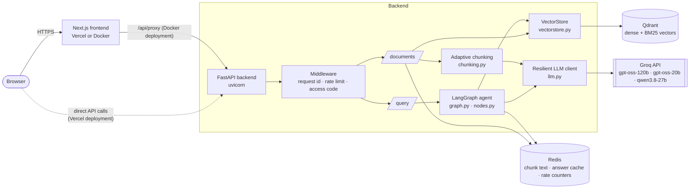
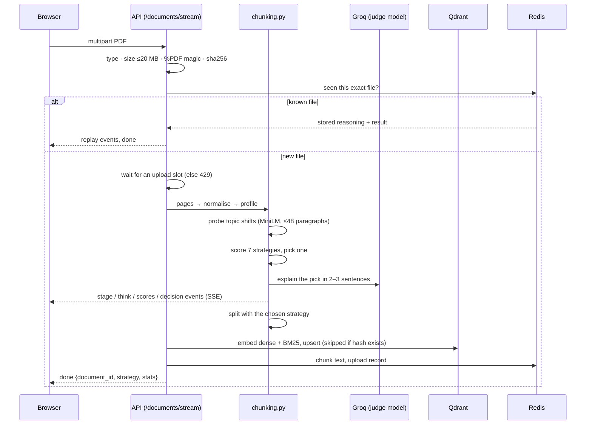
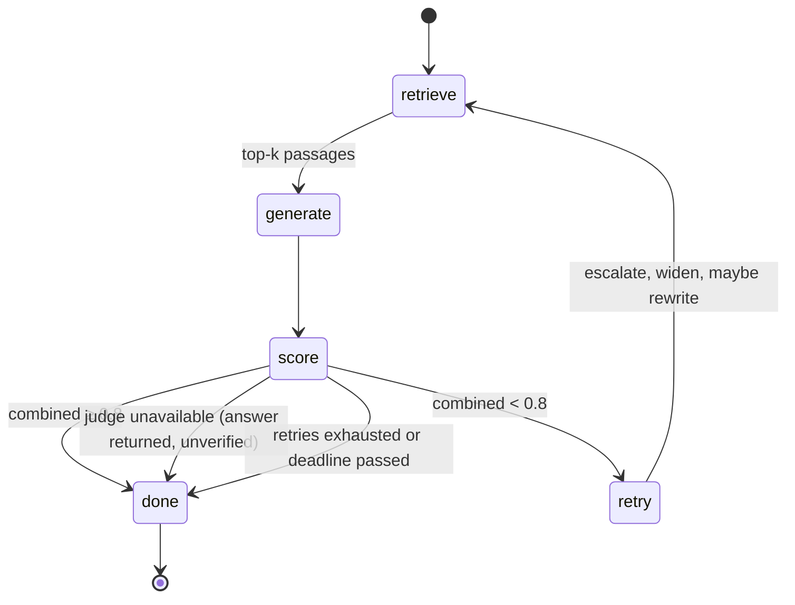

# Architecture

How ResilientRAG is put together, why, and where each piece lives. Every claim here
matches the code at the commit that introduced this file; file paths are given so you can check.

## 1. System overview

Two deployment shapes share one codebase:

| | Docker / VPS | Free demo |
|---|---|---|
| Frontend | Next.js container, same-origin `/api/proxy` | Vercel, calls the API directly (`NEXT_PUBLIC_API_URL`) |
| Backend | 2 uvicorn workers | 1 worker on a Hugging Face Space (Gradio SDK, no Docker) |
| Vectors | Qdrant server | in-process (`QDRANT_USE_MEMORY`), lost on restart |
| Redis | yes | none; an in-process limiter replaces it |
| TLS / auth | Caddy + access codes | platform TLS + access codes |

## 2. What happens when you upload a PDF

**Chunking decision** (`backend/app/agent/chunking.py`). The file is measured, not guessed:

1. `normalize_text` rebuilds paragraphs from PDF line breaks (page margins cut sentences).
2. `profile_document` counts headings, code-like lines, bullets, digits, paragraph and sentence length.
3. `topic_shift_ratio` embeds up to 48 spread-out paragraphs and measures how often neighbours drop below 0.30 cosine similarity.
4. `score_strategies` turns those numbers into a score per strategy, each with a one-line reason.
5. The highest-scoring *built* strategy wins; below 0.5 the recursive default wins.

| strategy | status | chosen when |
|---|---|---|
| recursive character | built, default | prose with ordinary sentences and paragraphs |
| structure-aware | built | ≥ 4 headings, density high |
| semantic | built | no headings and ≥ ~15% sharp topic shifts |
| code-aware | built | ≥ 10% of lines look like code |
| fixed-size | built | no usable structure (very long paragraphs, mostly digits) |
| sentence window, parent-child | **not built** | scored and shown, never selected: they embed one text and return another, which needs a second index |

The strategy is decided by measurement; the LLM only narrates it, so a Groq outage costs the prose, not the decision.

## 3. What happens when you ask a question

Retrieval escalation ladder (`nodes.py`, `retrieval.py`): `dense → dense_rerank → hybrid → hybrid_rerank`.
Hybrid is dense + BM25 fused with Reciprocal Rank Fusion; rerank is a cross-encoder over an over-fetched candidate list.

Two independent judges (`judges.py`), each returning schema-validated JSON:

| failure reason | meaning | action |
|---|---|---|
| `irrelevant_docs` | passages are about something else | escalate mode, budget +2, rewrite query from the 2nd retry |
| `missing_context` | on topic but incomplete | escalate mode, budget +3, rewrite query from the 2nd retry |
| `unfaithful_answer` | answer claims more than the passages support | keep the mode, budget +1, regenerate with a stricter prompt |
| `judge_unavailable` | the judge call itself failed | **stop**; return the answer with score 0 and flag it unverified |
| `none` | passed both judges | return |

`judge_unavailable` exists because a benchmark showed a rate-limited judge scoring correct answers 0.00 and the loop escalating retrieval for nothing. A failed judge says nothing about the answer.

Combined score = 0.5 × relevance + 0.5 × faithfulness; pass threshold 0.8 (`SCORE_PASS_THRESHOLD`); at most 3 retries.

## 4. Resilience mechanisms

| concern | mechanism | where |
|---|---|---|
| LLM errors | exponential backoff, honour `Retry-After`, then fall back to a smaller model | `llm.py` |
| Daily token quota spent | detected from the 429 text (`TPD`/`RPD`); switch model at once, no sleeping | `llm.py` |
| Abandoned requests | `Deadline` in a context var, checked before every attempt and sleep; cancelled on timeout or client disconnect | `llm.py`, `routers/query.py` |
| Redis down | cache and chunk store fail open; rate limiting falls back to an in-process counter | `cache.py`, `middleware.py` |
| Qdrant down | typed `RetrievalBackendError` → clean 503, no stack trace | `exceptions.py`, `main.py` |
| Upload bursts | semaphore (2 per worker), fast 429 with `Retry-After` | `routers/documents.py` |
| Query bursts | semaphore (12 per worker), 15 s queue timeout, 90 s run deadline | `routers/query.py` |
| Retired models | `/health/ready` lists configured models the key cannot see | `main.py` |
| Same file twice | sha256 → stored reasoning replayed, no analysis | `routers/documents.py` |
| Event-loop blocking | sync clients run in a sized thread pool; probes get their own threads | `main.py` |

## 5. Data and where it lives

| data | store | key | lifetime |
|---|---|---|---|
| vectors (dense + BM25) | Qdrant | collection `resilientrag_chunks_<hash>` | until deleted |
| chunk text | Qdrant payload, Redis, disk | `docchunks:<hash>`, `<upload_dir>/<hash>.json` | no TTL |
| upload record (reasoning + result) | Redis | `upload:<sha256>` | no TTL |
| answers | Redis | `(document hash, normalised query, retrieval mode)` | 1 h |
| rate counters | Redis (or process memory) | `ratelimit:s:<session>:<minute>` | 60 s |

`<hash>` is a content hash of the chunk list, so the same text indexed twice is embedded once, including across healing retries. The answer cache keys on retrieval mode so a cached `dense` answer is never served after the loop escalated.

### Document lifetime

With `DOCUMENT_EXPIRY_ENABLED` (on in the free Space) each browser **tab** registers as an owner of a document when it uploads or asks about it. The UI sends a per-page-load `X-Tab-Id` and calls `POST /documents/{id}/release` as the page closes or reloads (`fetch` with `keepalive`). A document is deleted from vectors, disk and Redis when its last owner releases it, or when no owner has touched it for `DOCUMENT_TTL_MINUTES` (a sweep runs every minute). Because a document id is a content hash, two people with the same file share one document, so it survives until both are gone. Bookkeeping is in-process (`agent/registry.py`), which is why it is single-worker only.

Re-uploading the exact same file (sha256) while its document still exists skips all analysis: the server answers with a `reused` event and the stored result. Without Redis that record lives in process memory.

## 6. Request pipeline and security

Outer to inner: `RequestIDMiddleware` → `RateLimitMiddleware` → `AccessCodeMiddleware` → router. Rate limiting is outside access control so rejected calls still count.

- **Access codes** (`ACCESS_CODES`, header `X-Access-Code`): constant-time compare; `/health`, `/health/ready`, `/auth/status` stay open. These are shared codes, not accounts.
- **Rate limits**: per browser session (`X-Session-Id`, 60/min) plus a per-IP ceiling (1,200/min) against session-id spraying.
- **Uploads**: PDF only, 20 MB cap, magic-byte check, temp file inside `upload_dir`, cleaned in `finally`, filename never used as a path.
- **Errors**: operational failures map to typed JSON responses; unhandled errors return an `error_id` and log the traceback with the request ID.

## 7. Frontend

`frontend/app/` (Next.js 15 app router, React 18, no UI library).

| file | role |
|---|---|
| `lib/api.ts` | typed client, SSE reader, session id, access code, direct vs proxy base URL |
| `components/useEventPlayer.ts` | plays the server's reasoning back at reading speed; `skip()` drains it |
| `components/ThinkingStream.tsx` | notebook view: stages, typed lines, the vote bars, verdict, chunk-size strip |
| `components/ChatPanel.tsx` | streamed retrieve / draft / judge / heal beats, answer, sources |
| `components/Doodles.tsx` | SVG doodles that draw themselves; reads `public/doodles/manifest.json` for your own images |
| `components/AccessGate.tsx` | asks for an access code when the API requires one |
| `api/proxy/[...path]/route.ts` | same-origin proxy that streams SSE through (Docker deployment) |

The server finishes its analysis in well under a second; the UI paces the events so a person can follow the reasoning. `<body data-busy="1">` speeds the doodles up while the agent works.

## 8. Known limits

- The two unbuilt chunking strategies (see §2).
- Access codes are not accounts: no per-user history, no document ownership.
- Retention is opt-in: with expiry off, documents persist until the volumes are deleted.
- Scanned PDFs without text are rejected; there is no OCR.
- Demo mode loses every document on restart and supports one worker only.
- Throughput is bounded by the LLM provider's quota, not by this code. See [`eval/results/RESULTS.md`](../eval/results/RESULTS.md).
